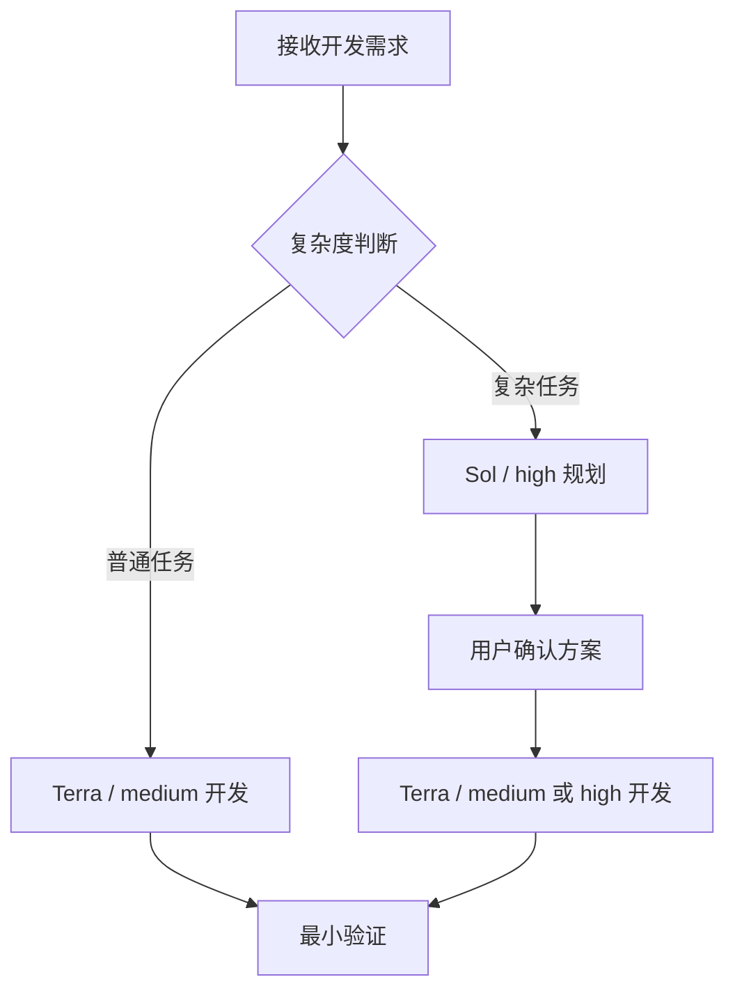

# Dev Team Lite（轻量开发小队）

一个面向复杂软件开发任务的轻量级多代理协作 Skill。

Dev Team Lite 的核心思路是：

> 让更强的模型进行少量、高价值的规划，再让开发能力可靠且成本更低的模型执行边界清晰的任务。

它通过减少代理数量、上下文复制、重复规划、推理强度和冗余输出，在保证开发质量的前提下降低 Token 消耗。

## 工作流程



## 模型分工

| 场景      | 模型              |     推理强度 | 说明                 |
| ------- | --------------- | -------: | ------------------ |
| 普通开发任务  | `gpt-5.6-terra` | `medium` | 跳过独立规划代理，直接执行明确任务  |
| 复杂需求规划  | `gpt-5.6-sol`   |   `high` | 分析架构、依赖、接口、风险和验收方法 |
| 常规开发任务  | `gpt-5.6-terra` | `medium` | 默认开发配置             |
| 高风险开发任务 | `gpt-5.6-terra` |   `high` | 用于安全、并发、迁移和核心架构代码  |
| 机械辅助任务  | `gpt-5.6-luna`  | `medium` | 可选，用于搜索、分类和格式转换    |
| 集成与验收   | 主代理             |     当前模型 | 检查变更并运行约定的最小验证     |

Sol 负责解决“应该怎么做”，Terra 负责完成“已经定义清楚的开发任务”。

Luna 不负责核心业务逻辑、架构决策、安全代码、数据迁移或并发控制。

## 主要特性

* 根据任务复杂度决定是否启动规划代理
* 使用 Sol 处理高价值规划问题
* 使用 Terra 作为默认开发模型
* 仅对高风险任务提升推理强度
* 每个开发代理只接收自己的任务上下文
* 默认使用一至三个开发代理
* 支持独立任务并行执行
* 支持需求增量规划
* 失败时只传递必要的错误摘要
* 不创建额外的审查代理
* 保护用户已有代码和未提交改动
* 用户确认后才开始修改业务代码

## 如何节省 Token

### 1. 简单任务不启动 Sol

普通且边界清晰的开发任务直接交给一个 Terra 处理，避免产生额外的规划上下文。

### 2. Sol 只进行一次紧凑规划

复杂任务才会启动 Sol。规划结果只包含：

* 开发目标
* 必要假设
* 共享接口
* 任务拆分
* 文件范围
* 验收方式
* 主要风险

不会输出背景复述、长篇分析过程或通用开发建议。

### 3. 使用任务级上下文

不会把完整对话和完整规划报告发送给所有开发代理。

每个 Terra 只接收：

* 当前任务目标
* 相关文件
* 必要接口
* 直接依赖
* 验收标准
* 允许执行的命令
* 简短失败边界

### 4. 控制代理数量

普通任务只使用一个 Terra。

复杂任务默认使用一至三个 Terra。只有任务真正独立，并行执行可以产生明显收益时，才会增加代理。

### 5. 动态调整推理强度

Terra 默认使用 `medium`。

只有 Sol 明确判断任务涉及安全、并发、迁移、核心架构或其他高风险逻辑时，才会将该任务提升为 `high`。

### 6. 增量处理需求变化

用户修改需求时，Dev Team Lite 只把需求差异交给原规划代理，不重新发送完整对话。

Sol 只更新：

* 受影响的任务
* 需要修改的接口
* 已失效的结论
* 新的验收条件

### 7. 压缩失败反馈

开发或验证失败后，只向原开发代理返回：

* 失败命令
* 核心错误片段
* 相关代码差异
* 剩余修复次数

不会发送完整日志，也不会重新创建一个代理从头理解任务。

## 使用方式

显式调用：

```text
$dev-team-lite 为 Vue 3 管理后台增加角色权限管理功能。
```

也可以使用自然语言：

```text
使用轻量开发小队，为现有项目增加登录、注册和权限管理功能。
```

Dev Team Lite 会先判断任务复杂度。

普通任务将展示简短方案；复杂任务会由 Sol 生成紧凑的开发计划。只有用户确认后，才会修改业务代码。

确认示例：

```text
确认按方案 v1 开发。
```

修改需求示例：

```text
保留短信验证码登录，取消用户名注册，其他方案不变。
```

Dev Team Lite 会暂停原计划、计算需求差异并生成新的确认版本。

## 复杂任务判断

符合以下任一条件时，可以视为复杂任务：

* 涉及多个业务模块
* 需要修改公共接口或数据结构
* 存在架构方案选择
* 涉及并发、安全或数据迁移
* 需求存在关键歧义
* 错误影响范围无法直接确定
* 可以拆分为两个以上真正独立的工作流

未满足这些条件时，优先使用一个 Terra 完成任务。

## 适用场景

Dev Team Lite 适合：

* 中小型功能开发
* Vue、React、Node.js 等常规项目需求
* 可以明确文件范围和验收方式的任务
* 希望控制 Token 或使用额度的开发任务
* 需要强模型规划，但不需要强模型编写全部代码的任务
* 可以拆分为少量独立工作的复杂功能

不适合：

* 极高风险的生产系统变更
* 大规模数据库迁移
* 需求完全不明确的探索项目
* 需要大量跨模块推理的核心架构重构
* 用户要求所有开发均由最高能力模型完成的任务

这些任务更适合使用完整版 `dev-team`。

## 与 Dev Team 的区别

| 对比项    | Dev Team    | Dev Team Lite    |
| ------ | ----------- | ---------------- |
| 定位     | 完整、安全优先     | 轻量、Token 优先      |
| 规划模型   | 固定 Sol/high | 仅复杂任务使用 Sol/high |
| 开发模型   | Terra/high  | 默认 Terra/medium  |
| 开发代理数量 | 按任务拆分       | 默认一至三个           |
| 上下文    | 完整约束和状态记录   | 任务级最小上下文         |
| 需求变化   | 完整重新规划      | 增量规划             |
| 失败反馈   | 完整错误管理      | 压缩错误摘要           |
| 审查方式   | 严格集成验收      | 主代理执行最小验收        |
| 适用任务   | 高风险、跨模块项目   | 常规及中等复杂度开发       |

## 安全边界

轻量模式只减少 Token，不会取消必要的安全边界。

Dev Team Lite 仍然遵循以下规则：

* 用户确认前不修改业务代码
* 不覆盖或回滚用户已有改动
* 同一文件同时只有一个写入者
* 不允许子代理继续创建下级代理
* 不静默更换指定模型
* 不通过包装命令绕过限制
* 不把未验证的结果描述为已经通过
* 需求发生变化时暂停受影响的开发工作

除非用户明确授权，否则不会执行：

* 部署或发布
* 数据库迁移
* 删除数据
* 上传文件
* 启动生产服务
* 全仓库格式化
* 修改任务范围之外的文件

## 环境要求

运行环境需要支持：

* Agent Skills
* 子代理创建、查询、等待和中断
* `gpt-5.6-sol`
* `gpt-5.6-terra`
* 可选的 `gpt-5.6-luna`
* `medium` 和 `high` 推理强度
* 项目文件及必要验证命令的访问权限

如果指定模型或必要能力不可用，Dev Team Lite 会停止对应阶段并说明原因，不会静默降级。

## 项目结构

推荐将 README 放在仓库根目录，Skill 文件单独放在 `dev-team-lite` 目录中：

```text
dev-team-lite-project/
├── README.md
└── dev-team-lite/
    ├── SKILL.md
    └── agents/
        └── openai.yaml
```

* `README.md`：面向使用者介绍功能、使用方法和设计原则。
* `SKILL.md`：面向代理定义执行流程和行为边界。
* `agents/openai.yaml`：定义展示名称、简介、默认提示词和调用策略。

## 调用配置

```yaml
interface:
  display_name: "轻量开发小队"
  short_description: "以更少上下文和代理完成软件开发任务"
  default_prompt: "使用 $dev-team-lite 以省 Token 模式完成当前开发任务。"

policy:
  allow_implicit_invocation: true
```

## 设计原则

Dev Team Lite 的目标不是使用能力最弱的模型，也不是创建尽可能多的代理。

它追求的是：

> 把高成本推理集中在少数关键决策上，把已经定义清楚的工作交给可靠且更具性价比的开发模型。

实际 Token 消耗仍然取决于项目规模、上下文长度、代理数量、推理强度和失败次数，因此轻量模式是一种优化策略，不是固定的节省比例承诺。
