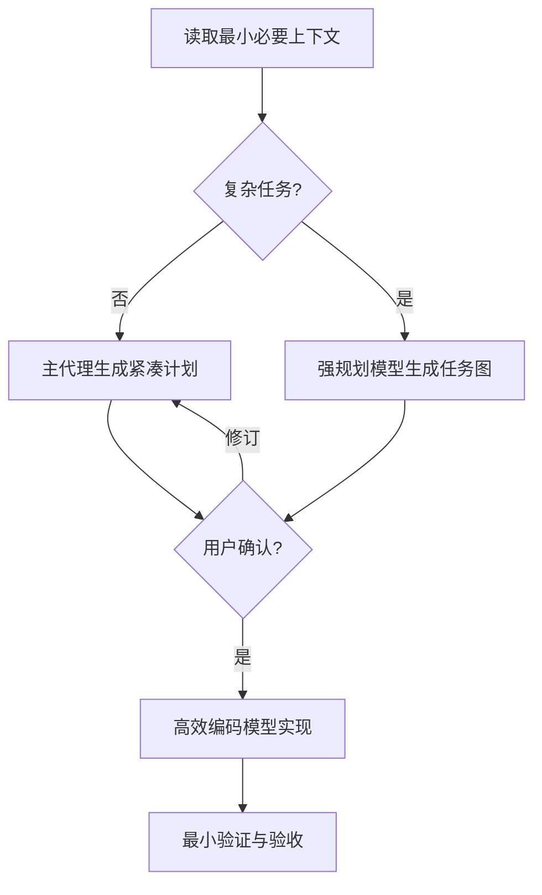

# Dev Team Lite（轻量开发小队）

Token 优先的多代理软件开发 Skill。复杂任务使用强规划模型压缩问题空间，再由满足要求且更高效的编码模型完成局部实现；简单任务会跳过规划子代理。

## 适用场景

- 希望在复杂开发中减少上下文和代理调度开销
- 仓库较大，不希望每个代理重复读取完整历史
- 可以先明确边界，再把任务交给高效编码模型
- 仍然需要用户确认、唯一写入者和验证门禁

安全、并发、迁移、公共接口或核心架构等高风险改动可以使用，但开发阶段会提高模型能力或推理强度；若质量优先于消耗，应选择更完整的质量流程。

## 触发方式

```text
$dev-team-lite
```

或使用肯定的自然语言指令：

```text
使用轻量开发小队重构缓存模块，尽量减少 Token。
```

否定、引用、讨论或审查 Skill 本身不会触发开发流程。

## 节省方式

1. 简单任务不创建规划子代理。
2. 每个开发代理只接收局部上下文，不转发完整历史。
3. 默认只创建一个开发代理，真正独立时才并行。
4. 常规开发使用满足要求的均衡模型和中等推理强度。
5. 合并共享大量上下文的任务，优先复用已有代理。
6. 需求变化只传递差异，不重新发送全部材料。
7. 不创建独立审查代理，由主代理完成最小集成检查。

减少 Token 不等于保证固定比例的费用下降。实际消耗取决于任务、仓库、模型计费、失败次数和验证范围。

## 工作流程



复杂任务通常包括跨模块改动、公共接口或数据结构变化、安全/并发/迁移、显著歧义、影响范围不清，或两个以上独立工作流。

## 动态模型选择

Skill 不写死模型名称，只使用子代理工具在当前运行时明确公布的信息：

| 角色 | 默认策略 |
| --- | --- |
| 复杂规划 | 复杂推理和任务压缩能力强的模型，支持时使用 `high` |
| 常规开发 | 编码可靠且速度、消耗均衡的模型，支持时使用 `medium` |
| 高风险开发 | 提高到更强模型或 `high` 推理强度 |
| 机械任务 | 快速模型，使用 `low` 或 `medium` |

不根据模型名称或价格猜测能力。能力信息不足时省略覆盖并继承当前配置；用户指定的模型不可用时停止说明，不静默替换。多个模型都满足角色要求时，只依据运行时明确提供的信息选择预计成本或延迟更低者；升级模型或推理强度会在计划中说明原因。

## 关键边界

- 用户确认当前计划前不修改业务代码。
- 子代理工具不可用时停止并说明，不由主代理冒充或静默退化。
- 复杂任务最多创建一个规划子代理。
- 通常使用一至三个开发子代理，同时活跃不超过三个。
- 每个文件和生成物同时只有一个写入者。
- 子代理不得创建下级代理。
- 不自动授权部署、发布、迁移、上传、删除数据或外部写操作。
- 未列入允许清单的命令默认不执行。
- 已确认计划中的普通本地验证视为已授权；外部副作用仍需单独授权。
- 主代理可处理不改变业务行为、契约、数据结构和安全逻辑的小型集成修复，避免额外代理调用。

## 行为验证

`evals/cases.md` 覆盖简单/复杂任务路由、代理数量、局部上下文、模型升级、确认门禁、文件冲突、工具恢复和完成判定。Eval 文件不会在正常使用 Skill 时自动加载。

## 文件结构

```text
dev-team-lite/
├── LICENSE
├── SKILL.md
├── README.md
├── agents/
│   └── openai.yaml
├── evals/
│   └── cases.md
└── references/
    ├── change-control.md
    └── failure-recovery.md
```

低频的需求变化和故障恢复规则按需读取，不增加正常执行的入口上下文。

## 安装

用户级安装位置：

```text
~/.agents/skills/dev-team-lite/
```

仓库级安装位置：

```text
<repo>/.agents/skills/dev-team-lite/
```

安装后使用 `$dev-team-lite` 显式调用。

## 设计取向

Dev Team Lite 优化完整任务的总消耗，而不是追求单次调用的最低价格。它把较强能力集中在真正复杂的规划和高风险实现上，其余步骤使用最小充分资源。

## License

本项目使用 MIT License，详见 `LICENSE`。
